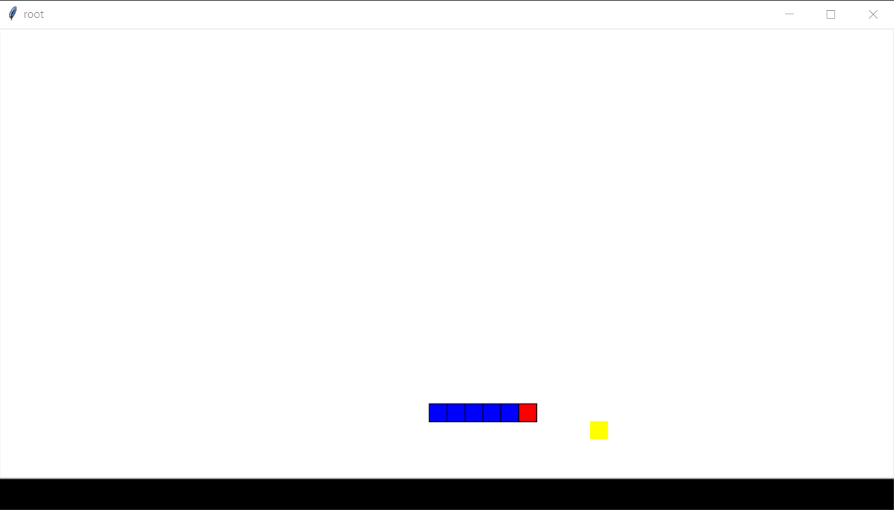
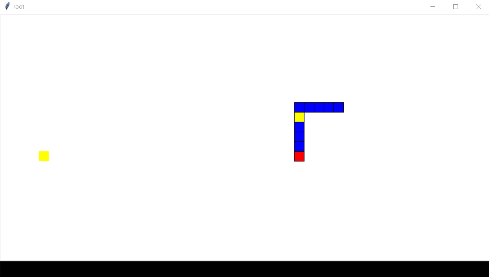
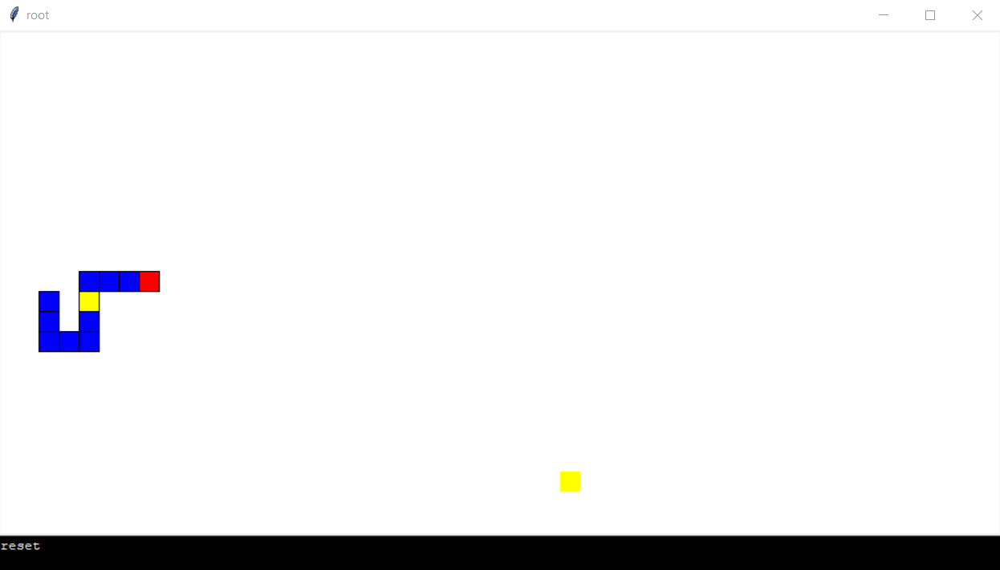

# SnakeGame
In high school I tried to create a snake game in Python. It contains only the movement and eating of the points. I also tried to implement a CLI so there are several commands to be used (find them in code).

## Requirements
 - Python 3
 - tkinter

## Credits
- [Tomáš Žilínek](https://www.linkedin.com/in/tomaszilinek)

